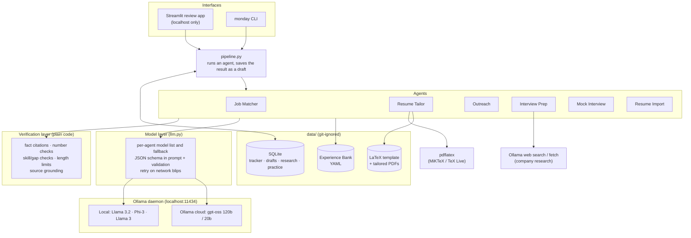
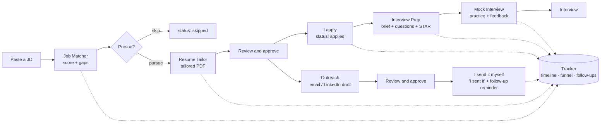

# MONDAY

*The day everyone gets back to work: human or agent.*

MONDAY is a multi-agent system that runs my job search. I used to do the whole thing by hand for
every role: tailor resume bullets to the job description, keep them ATS-friendly, write to people
at the company, prepare answers, and keep track of it all. That took hours a week, so I built
agents to do the drafting while I make the decisions.

It takes a job description (JD) and produces:

- a **match score** with the evidence and the gaps,
- a **tailored one-page resume** in my own LaTeX template,
- **cold emails and LinkedIn messages** to real people at the company,
- an **interview prep sheet** with sourced company research,
- **mock interviews** with feedback on my answers,

and it **tracks every application** like a small CRM.

> **Draft-only by design.** Every agent output is a draft that I review, edit and approve.
> MONDAY has no email or LinkedIn credentials and no send function: it *cannot* message anyone.
> A bad automated message burns a real recruiter relationship, so the safest guard is a
> capability that doesn't exist.

---

## Contents

- [Design principles](#design-principles)
- [Architecture](#architecture)
- [The pipeline](#the-pipeline)
- [The agents](#the-agents)
- [The verification layer](#the-verification-layer)
- [Models](#models)
- [The review app](#the-review-app)
- [Data and privacy](#data-and-privacy)
- [Project structure](#project-structure)
- [Setup](#setup)
- [Usage](#usage)
- [Configuration](#configuration)
- [Testing](#testing)
- [Troubleshooting](#troubleshooting)
- [Limitations and roadmap](#limitations-and-roadmap)

---

## Design principles

1. **Draft-only, enforced by absence.** No send function exists anywhere in the codebase. Approving a
   draft marks it ready; I send it myself and click **"I sent it"** to log it.
2. **The model writes, code verifies.** Every agent's output passes checks in plain Python before I
   see it: cited facts must exist, numbers must match their sources, and skills I don't have can't be
   claimed. A model can't mark its own homework.
3. **No invented experience.** Agents only select, reorder and rephrase facts from my
   **Experience Bank** (see [Data and privacy](#data-and-privacy)). Every tailored bullet cites the
   facts it came from. A bullet that fails the checks falls back to my original wording.
4. **The Tracker is code, not a model.** Where an application stands is decided by code and written to
   an append-only timeline. The funnel metrics are computed from that timeline.
5. **Local-first.** Personal data stays on my machine. The app is served only on `localhost`.
   Extraction and scoring run on local models; only the writing agents use cloud models.
6. **Scores I can explain.** The match score and the ATS keyword coverage are plain, deterministic
   calculations. The model extracts the requirements; it doesn't invent the number.

---

## Architecture



| Layer | What it does | Where |
|---|---|---|
| Interfaces | The Streamlit app for daily use; the CLI for scripting | `app.py`, `monday/cli.py` |
| Pipeline | Runs an agent, stores its output as a **pending draft**, logs the event | `monday/pipeline.py` |
| Agents | One job each, with typed (Pydantic) inputs and outputs | `monday/agents/` |
| Verification | Plain-code checks that reject or flag what the model wrote | inside each agent + `monday/skills.py` |
| Model layer | Picks the model for each agent, validates JSON, falls back, retries | `monday/llm.py` |
| Tracker | Applications, contacts, drafts, approvals, timeline, metrics | `monday/tracker.py`, `monday/db.py` |
| Resume output | Renders into my LaTeX template and compiles the PDF | `monday/resume_tex.py`, `monday/resume_build.py`, `monday/latex.py` |
| Research | Web search / fetch for company research, cached per company | `monday/research.py` |

**Why no agent framework (LangGraph, CrewAI)?** The workflow is a mostly fixed pipeline with a human
decision between each step, not open-ended agents choosing their own tools. Plain Python with typed
hand-offs is easier to test, debug and explain. The human approval step is a status on a draft in the
database, not a framework feature, so it survives restarts and is easy to check later.

---

## The pipeline



Every box that calls a model ends in a **draft**, and nothing moves forward without my decision.
The application moves through these statuses:

`discovered → preparing → applied → responded → interviewing → offer`
(or `skipped` · `rejected` · `withdrawn`)

---

## The agents

### 1. Job Matcher: *is this role worth my time?*

| | |
|---|---|
| **Model** | Local **Llama 3.2 3B** (fallbacks: Phi-3, Llama 3) |
| **Input** | JD text + Experience Bank |
| **Output** | Score 0–100, recommendation (pursue / stretch / skip), each requirement with its evidence, gaps, warnings |

1. **Extract (model):** pull out the must-have and nice-to-have skills, seniority, minimum years and
   work mode. Alternatives like *"Qdrant, Pinecone, or pgvector"* count as **one** requirement.
2. **Ground (code):** any skill the model lists that the JD never mentions is **dropped**, so a small
   model can't slip in invented requirements.
3. **Match (code):** normalize names (`Postgres` = `PostgreSQL`, `Node.js` = `NodeJS`), match them
   against my skills, the facts behind them, project tech stacks and skill-group names, and cite
   the evidence.
4. **Score (code):** `75% × must-have coverage + 25% × nice-to-have coverage`.
   Pursue ≥ 65, stretch ≥ 40, otherwise skip. It also flags "5+ years" and senior-level roles.

### 2. Resume Tailor: *the same true facts, emphasized for this job*

| | |
|---|---|
| **Model** | Ollama cloud **gpt-oss:120b** (fallback: gpt-oss:20b) |
| **Input** | JD, match report, Experience Bank, my LaTeX template |
| **Output** | A tailored `.tex` and one-page PDF in **my own layout**, plus ATS keyword coverage before and after |

- The model rewrites the bullets for each role and project, and **every bullet cites the fact ids it came from**.
- Code rejects a bullet that:
  - cites facts from another section,
  - adds a number not in its cited facts,
  - names a skill its facts don't support, or
  - runs longer than about 2 lines (230 characters).
- Rejected bullets get **one correction round**, then fall back to my **original wording**, so the
  result is never an unverified claim.
- Plain code **orders projects by relevance** to the JD and **moves JD skills to the front** of each skill group.
- Only Summary, Experience, Projects and Skills are regenerated. The header, Education,
  Certifications and Achievements are copied **word for word** from my template.
- **ATS coverage** reports two things separately: skills the resume doesn't show yet, and real gaps
  that were correctly not claimed.

### 3. Outreach: *a message worth a stranger's two minutes*

| | |
|---|---|
| **Model** | gpt-oss:120b (fallback: 20b) |
| **Input** | Contact + **my notes about them**, JD, match report, Experience Bank |
| **Output** | Cold email (with subject), LinkedIn connection note (≤ 200 characters), LinkedIn message, or follow-up |

Personal details come **only from the notes I write** about the contact (their About section, a
recent post, how I found them). There is no scraping and no web lookup of people.

| Check | Result if it fails |
|---|---|
| Claims about me cite facts; numbers come from those facts or my notes | Hard fail |
| Placeholders like `[Name]`, fact ids leaking into the text, over the length limit, no subject | Hard fail |
| A detail about the contact that isn't in my notes | Warning |
| Mentions a skill I don't have | Warning |
| Not addressed by name, no sign-off, clichés ("I hope this email finds you well") | Warning |

Hard fails get one retry; anything still failing is shown in red in review.

After I approve a message, the app shows it with **copy**, **Open in my email app** (`mailto:`) and
**Open their LinkedIn** buttons. I send it myself, then click **"I sent it"**, which logs the send and
schedules a follow-up 5 days later. A follow-up draft is written with my earlier approved message to that person as context.

### 4. Interview Prep: *sourced research and honest answers*

| | |
|---|---|
| **Models** | Ollama web search/fetch + gpt-oss:120b |
| **Input** | Company, role, JD, match report, Experience Bank (and the company website, if I add it) |
| **Output** | A prep sheet: company brief, likely questions with talking points, STAR outlines, questions to ask them |

1. **Research:** four targeted searches (overview, engineering and tech stack, recent news,
   interview process), plus the company website if given. Results that don't mention the company
   are filtered out. Research is **cached per company**, so a second role at the same company reuses it.
2. **Brief:** every point must cite a retrieved source (`[S3]`), and its numbers must appear in that
   source. **Points without a real source are dropped.** Web pages are treated as data only; any
   instructions inside them are ignored.
3. **Questions:** technical, resume deep-dive, behavioral, **gap** and "why this company".
   - Talking points cite my facts.
   - Gap questions coach an **honest** answer: adjacent experience and how I'd ramp up, never a false claim.
4. **STAR outlines:** built from real facts. Everything the facts don't say (what went wrong, what I
   decided) becomes a **fill-in question for me**. I rewrite the outline in my own words and click
   **"Save as story"** to add it to the Experience Bank; saving an unedited outline is refused.

### 5. Mock Interview: *practice with a coach that knows my record*

| | |
|---|---|
| **Model** | gpt-oss:120b (fallback: 20b) |
| **Input** | Questions from the prep sheet + my typed answer |
| **Output** | Scores, strengths, improvements, a follow-up question, a stronger version of my answer |

- **Code checks on my answer:**
  - numbers **not in my Experience Bank** (a misremembered metric, like saying 8 when my record says 5.3),
  - claimed skills I don't have,
  - speaking length at about 130 words per minute.
- These findings are passed to the model, so its feedback addresses them directly.
- **Scores from 1 to 5:** relevance, structure (STAR for behavioral), specificity, clarity.
- A **follow-up question** based on what I actually said, the way real interviewers probe.
- A **stronger version of my answer**, built only from my words and my facts. It's retried once and
  **withheld** if it adds numbers, gap skills or fact ids.
- My prep sheet's talking points are revealed only **after** I answer.
- Sessions are saved; the dashboard shows averages per area and the score trend across sessions.

### 6. Tracker: *the CRM, written as code*

Not a model. It stores companies, jobs, applications, contacts, drafts and approvals, and every
change goes to an append-only **timeline**. The dashboard reads from it:

- **Funnel:** how many applications *reached* each stage, not just where they sit now.
- **Draft quality:** approved as-is vs. approved with edits vs. rejected. This measures how good the
  agents really are.
- **Follow-ups due** and **interview practice progress**.

### Supporting: Resume Import

Upload a new resume version (`.tex`, or `.pdf` for the bank only):

1. Known LaTeX problems are fixed automatically (e.g. `\faFileAlt` → `\faFile*` for `fontawesome5`),
   the template is checked for the commands the Tailor needs, and a preview is compiled.
2. A model extracts a **proposed** Experience Bank. Every number in it must appear in the uploaded
   resume, otherwise it's flagged.
3. I review the changes, which are matched by content: facts **added / reworded / removed**. I can
   edit the YAML, then click **Apply**. The old bank and template are backed up first, and existing
   fact ids and interview stories are kept.

---

## The verification layer

This is the part that makes the output trustworthy enough to send under my name.

| Agent | What code checks | What happens on failure |
|---|---|---|
| Job Matcher | Extracted skills actually appear in the JD | Dropped from scoring |
| Resume Tailor | Cited facts exist and belong to the section; no new numbers; no unsupported skills; length | 1 retry → original wording |
| Outreach | Citations; numbers; placeholders; fact-id leaks; length; contact details are in my notes | 1 retry → shown as failed / warned |
| Interview Prep (brief) | Every point cites a real retrieved source; numbers appear in that source | Point dropped |
| Interview Prep (questions) | Citations; numbers; no claimed gap skills | 1 retry → item dropped |
| Mock Interview | My numbers vs. my records; gap claims; length; the rewrite adds nothing new | Flagged / rewrite withheld |
| Resume Import | Every extracted number appears in the uploaded resume | Flagged for review |
| My own edits | The same checks re-run live as I edit a draft | Warning (I have the final say) |

The number check (`numbers()` in `resume_tailor.py`) normalizes `10,000` / `10 000` / `10000`, so a
reworded bullet can't quietly turn "5.3 points" into "40%".

**What code can't catch:** vague embellishments with no number or skill name in them (e.g. "for
robust predictions"). That's why every output stays a draft for a person to read.

---

## Models

| Agent | Models (in order) | Why |
|---|---|---|
| Job Matcher | `llama3.2:3b` → `phi3` → `llama3` | Extraction is simple; local is free, private and fast enough |
| Resume Tailor, Resume Import, Outreach, Interview Prep, Mock Interview | `gpt-oss:120b-cloud` → `gpt-oss:20b-cloud` | Writing quality matters; a 3B model's drafts would cost more time in edits than they save |

- **One client for both.** Local and cloud models both go through the local Ollama daemon.
- **No silent downgrade.** Writing agents never fall back to a 3B model; they fail loudly instead.
- **Model on every draft.** Each draft records which model actually produced it.
- **Structured output everywhere.** Local models follow Ollama's JSON-schema `format`, but cloud
  `gpt-oss` ignores it. So the model layer puts the schema in the prompt, pulls the JSON out of any
  surrounding text, validates it with Pydantic, and gives an invalid reply one retry.
- **Network resilience.** DNS failures, timeouts and 502/503/504 are retried on the same model
  (after 2s, then 5s). Permanent errors, such as 402 "needs paid credits" or 404 "no such model",
  fail immediately.
- **Hardware.** Built on a Ryzen 5 5600H laptop with 7.4 GB RAM and no dedicated GPU. That's why
  the local models are ≤ 8B, and why Llama 3 8B (about 3 minutes per JD) is last in line.

Measured on the same JD:

| Model | Score | Time | Notes |
|---|---|---|---|
| `llama3.2:3b` | 85 | ~35 s | Accurate, fastest |
| `phi3` | 85 | ~1 m 46 s | Accurate |
| `llama3` | 88 | ~2 m 40 s | Most faithful to "either/or" wording, but slow on this RAM |

---

## The review app

`streamlit run app.py` opens on `http://localhost:8501`, reachable from this machine only.

| Page | What's there |
|---|---|
| **Review queue** | Every pending draft. **Match reports:** pursue / skip / reject the analysis. **Resumes:** the PDF next to editable bullets (showing the facts each cites), coverage and anything the checks rejected; the PDF must be rebuilt after edits before approving. **Outreach:** editable text with a live character count and live checks. **Prep sheets:** tabbed, with "Save as story". |
| **Applications** | Add a JD (optionally scored right away); run the Matcher, Tailor and Interview Prep; status, next action and due date; company website; contacts and outreach (draft, ready to send, "I sent it", history); the approved prep sheet; the timeline. |
| **Mock interview** | Pick an application, the number of questions and the question types; answer; get feedback and a follow-up; session summary with your weakest area. |
| **My resume** | Upload a `.tex` / `.pdf`, preview it, extract a proposed Experience Bank, review the changes, apply with backup. |
| **Dashboard** | Funnel, draft quality, interview practice progress, follow-ups due. |

---

## Data and privacy

| What | Where | In git? |
|---|---|---|
| Experience Bank: the only facts agents may use | `data/experience_bank.yaml` | ❌ ignored |
| Resume source, LaTeX template, backups | `data/resume/` | ❌ ignored |
| Tracker database (applications, contacts, drafts, research, practice) | `data/monday.db` | ❌ ignored |
| Tailored resumes, prep sheets | `data/output/app-<id>/` | ❌ ignored |
| Ollama API key | `.env` | ❌ ignored |
| Code, config, example bank | everything else | ✅ |

- **The API key** is read from `.env` into the config **without** being put into the environment, so
  it isn't sent on local model calls. Only the research client sends it, and only to ollama.com's
  web search endpoints.
- **The app** listens on `localhost` only (`.streamlit/config.toml`), because it shows personal data.
- **What leaves the machine:** prompts for the writing agents go to Ollama's cloud models, and
  company names go to web search. Job-matcher extraction stays fully local.

**Experience Bank format.** One fact per accomplishment, each with a stable id; `**bold**` is kept in
the PDF:

```yaml
roles:
  - company: Example Corp
    title: Software Engineer
    start: 2023-07
    end: present
    facts:
      - id: excorp-latency
        text: Cut checkout API latency by moving hot reads to a **Redis** cache
        skills: [Python, Redis, FastAPI]
        metrics: ["p95 latency 800ms -> 120ms"]
```

Skill tags help with matching, but they're **not evidence**: a tailored bullet can only say what the
fact text and metrics say. See `examples/experience_bank.example.yaml` for a full example with
projects, education, certifications, achievements and STAR stories.

---

## Project structure

```
MONDAY/
├── app.py                      # Streamlit review app
├── config.yaml                 # models per agent, paths, outreach settings
├── .env                        # OLLAMA_API_KEY (git-ignored, you create it)
├── .streamlit/config.toml      # serve on localhost only
├── examples/
│   └── experience_bank.example.yaml
├── monday/
│   ├── agents/
│   │   ├── job_matcher.py      # requirements extraction + deterministic scoring
│   │   ├── resume_tailor.py    # grounded bullet rewriting + checks
│   │   ├── outreach.py         # emails / LinkedIn drafts + checks
│   │   ├── interview_prep.py   # sourced brief, questions, STAR outlines
│   │   └── mock_interview.py   # answer feedback + checks
│   ├── pipeline.py             # runs agents, stores drafts (shared by app and CLI)
│   ├── llm.py                  # model routing, JSON extraction/validation, retries
│   ├── skills.py               # skill normalization and matching
│   ├── experience.py           # Experience Bank schema + validation
│   ├── tracker.py              # the CRM: applications, contacts, drafts, timeline, metrics
│   ├── db.py                   # SQLite schema + migrations
│   ├── research.py             # Ollama web search / fetch, relevance filter
│   ├── resume_import.py        # upload -> proposed Experience Bank + template checks
│   ├── resume_tex.py           # render into the LaTeX template
│   ├── resume_build.py         # compile + ATS keyword coverage
│   ├── latex.py                # find pdflatex, escape text, compile
│   ├── config.py               # config.yaml + .env loading
│   └── cli.py                  # the `monday` command
├── tests/                      # 105 tests
└── data/                       # your personal data (git-ignored)
```

---

## Setup

### Prerequisites

| Need | For | Notes |
|---|---|---|
| Python 3.11+ | everything | |
| [Ollama](https://ollama.com) | all models | signed in, for cloud models |
| Local models | Job Matcher | `ollama pull llama3.2:3b` (optional fallbacks: `phi3`, `llama3`) |
| Ollama API key | Interview Prep web research | free, from ollama.com |
| MiKTeX or TeX Live | tailored PDFs | provides `pdflatex`; without it you still get the `.tex` |

### Install

```bash
git clone https://github.com/Shrishkd/MONDAY-Multi-AI-Agent-System.git
cd MONDAY-Multi-AI-Agent-System
python -m venv .venv
.venv/Scripts/pip install -e ".[dev]"      # Windows; use .venv/bin/pip on macOS/Linux
ollama pull llama3.2:3b
```

Create `.env` in the project root (it's git-ignored):

```
OLLAMA_API_KEY=your-key-here
```

Then:

```bash
monday init       # creates data/monday.db and a starter data/experience_bank.yaml
monday doctor     # checks Ollama, every configured model, the bank, pdflatex, the template
```

### Your resume and Experience Bank

The easiest way is to upload it: open the app → **My resume** → upload your `.tex` → **Extract** →
review → **Apply**. The Tailor expects a template in the style of *Jake's Resume*, i.e. one that
defines these commands:

`\resumeSubheading`, `\resumeItem`, `\resumeProjectHeading`, `\resumeSubHeadingListStart/End`,
`\resumeItemListStart/End`, `\resumeProjectListStart/End`, with sections named **Summary**,
**Experience**, **Projects** and **Skills**. The upload page tells you if anything is missing.

---

## Usage

### The app (daily use)

```bash
streamlit run app.py
```

1. **Applications → Add a job:** paste the JD. It's scored right away.
2. **Review queue:** read the match report → **Pursue** or **Skip**.
3. **Tailor resume** → review the PDF and bullets, edit, rebuild, **Approve** → apply with it.
4. **Contacts & outreach:** add a person with notes → draft an email or LinkedIn note → approve →
   send it yourself → **I sent it**.
5. **Prepare for interview** → approve the prep sheet → turn STAR outlines into saved stories.
6. **Mock interview** → practice until the dashboard trend goes up.

### CLI reference

| Command | What it does |
|---|---|
| `monday init` | Create the database and a starter Experience Bank |
| `monday doctor` | Check Ollama, models, bank, `pdflatex`, template |
| `monday add-job --company C --title T --jd-file jd.txt [--url --location --source]` | Save a JD, open an application |
| `monday match <id>` | Score the JD against the Experience Bank |
| `monday tailor <id>` | Tailored `.tex` + PDF, saved as a draft |
| `monday add-contact <id> --name N [--role --email --linkedin --notes]` | Add a person at the company |
| `monday outreach <id> --contact <cid> [--kind cold_email\|linkedin_note\|linkedin_message\|follow_up]` | Draft a message (never sent) |
| `monday prep <id> [--refresh]` | Research + prep sheet, also written to `interview_prep.md` |
| `monday list [--status S]` · `monday show <id>` | Applications · one application's timeline |
| `monday status <id> <status> [--note]` | Move an application to a stage |
| `monday funnel` | Stage counts and draft-review stats |

---

## Configuration

`config.yaml`:

| Key | Meaning |
|---|---|
| `agents.<agent>` | Ordered model list; the first that answers wins |
| `paths.experience_bank` / `database` / `resume_template` / `output` | Where data lives (default `data/…`) |
| `pdflatex` | Full path to `pdflatex`, or empty to auto-detect (PATH, then the default MiKTeX folders) |
| `outreach.linkedin_note_chars` | Connection-note limit: 200 on free LinkedIn accounts, 300 on Premium |
| `outreach.follow_up_days` | Days after "I sent it" before the follow-up reminder |

`.env`: `OLLAMA_API_KEY` (web research only).

---

## Testing

```bash
pytest
```

105 tests cover:
- **Fabrication checks:** invented numbers, unsupported skills, fact ids from the wrong section, gap
  claims, fact-id leaks.
- **Scoring and matching:** aliases, "X or Y" requirements, skill groups.
- **LaTeX:** rendering the template (an identity render reproduces it unchanged), escaping
  model-generated Unicode, compiling (skipped if `pdflatex` isn't installed).
- **Model layer:** JSON extraction from prose, invalid-JSON retry, fallback between models,
  network-retry behavior.
- **Tracker:** the funnel, the draft approval gate, "I sent it", database migrations.
- **Resume import:** matching facts by content, keeping ids, backups.
- **Research:** relevance filtering and handling of failed searches.

Model calls are replaced with fakes in tests; real-model behavior was checked by running each
agent on real JDs during development.

---

## Troubleshooting

| Symptom | Cause | Fix |
|---|---|---|
| `lookup ollama.com: no such host` | Your DNS failed (often a flaky router) | MONDAY retries automatically. For a lasting fix: Settings → Network & internet → Wi-Fi → your network → DNS server assignment → Edit → Manual → IPv4: `1.1.1.1` / `8.8.8.8` |
| `Failed to connect to Ollama` | The Ollama daemon isn't running | Start the Ollama app, or run `ollama serve` |
| HTTP 402 "not included in your free usage" | That cloud model needs paid credits | Use `gpt-oss` models (free tier), or add credits |
| `MiKTeX cannot retrieve attributes for the directory '...node.exe\'` | A `PATH` entry points to a file | MONDAY works around it; to fix it for good, remove that entry from `PATH` |
| `pdflatex: major issue: you have not checked for MiKTeX updates` | Fresh MiKTeX | MiKTeX Console → Updates → **Update now**. Use a stable connection: an interrupted update can break the install |
| `Undefined control sequence \faFileAlt` | `fontawesome5` uses starred names for `-alt` icons | Resume import fixes it automatically (`\faFile*`, `\faExternalLink*`) |
| Tailored resume runs to 2 pages | Longer bullets than your original | The review page warns you; trim bullets and rebuild |

---

## Limitations and roadmap

**Known limits**

- **Vague embellishments** ("robust", "that can scale") aren't caught by code; they're caught by
  reviewing every draft.
- **STAR outlines are the model's framing** of my facts. The app requires me to rewrite them before
  they become stories.
- **Mock interviews are typed, not spoken.** Voice would need local speech-to-text (Whisper), which
  is heavy on 7.4 GB RAM.
- **Single user, single machine.** SQLite and a local app, on purpose.
- **No job discovery or scraping.** I paste JDs; LinkedIn scraping breaks its terms of service and
  gets accounts banned.

**Roadmap**

- Voice answers and timing pressure in mock interviews
- Per-agent quality trends (edit rates over time) on the dashboard
- Email integration that reads replies to update the status (read-only; still never sends)
- Evaluation sets for each agent, so model or prompt changes are measured rather than eyeballed

---

*Built by [Shrish](https://github.com/Shrishkd).*
